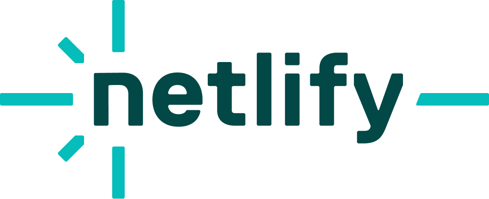

# Fingerprint OSS

[](https://opensource.org/licenses/LGPL-2.1)
[](https://www.npmjs.com/package/fingerprint-oss)
[](https://github.com/IntegerAlex/fingerprint-oss/stargazers)
[](https://www.npmjs.com/package/fingerprint-oss)
[](https://github.com/IntegerAlex/fingerprint-oss/issues)
[](https://github.com/IntegerAlex/fingerprint-oss/pulls)


> A free and open source fingerprinting service unlike FingerprintJS.

## ⚠️ Important Notice

This library is released under the LGPL-3.0 license and includes ethical guidelines for usage. Please read our [Ethical Contribution Notice](./NOTICE.md) before using this library. We are committed to:

- Transparent data collection
- User privacy protection
- Ethical usage of fingerprinting technology
- Compliance with privacy regulations

## About

Fingerprint OSS is a fork of user-info-logger, a simple client-side fingerprinting library that logs user information. Unlike commercial alternatives that are "source available" but not truly open, Fingerprint OSS is released under the LGPL-3.0 license, making it fully open source and free to use.

<p>
  
  
  
</p>

<p>Fingerprint-OSS is now backed by Cloudflare OSS, Neon, and Netlify.</p>


## Demo

- [Live Demo](https://fingerprint-oss-demo.vercel.app/)
- [Demo Repository](https://github.com/IntegerAlex/fingerprint-oss-demo)

## Features

- Lightweight browser fingerprinting
- Easy integration with any web application
- 100% client-side operation (except the GeoLocation API)
- Comprehensive user data collection
- VPN detection
- Incognito mode detection
- AdBlocker detection
- Bot detection
- GDPR compliance support

## Installation

Install via npm:

```bash
npm install fingerprint-oss@latest
```

## Usage

Basic usage:

```javascript
import userInfo from 'fingerprint-oss';
const data = await userInfo();
```

## Configuration for GDPR Compliance

```javascript
const config = {
    transparency: true,
    message: 'Custom message about data collection'
};

const data = await userInfo(config);
```

Configuration options:
- `transparency`: If true, logs a message to the console about data collection
- `message`: Custom message to be logged to the console

## Documentation

- [API Documentation](./API.md) - Detailed API reference and output structure
- [Wiki](https://deepwiki.com/IntegerAlex/fingerprint-oss)
- [Changelog](./CHANGELOG.md)
- [Ethical Contribution Notice](./NOTICE.md)

## Data Collected

Fingerprint OSS can collect information about:

- Browser type and version
- Operating system
- Screen resolution
- Installed plugins
- Language settings
- Time zone
- Hardware information
- Canvas fingerprinting
- WebGL capabilities
- VPN status
- Incognito mode status
- AdBlocker status
- Bot detection
- And more...

For a complete list of collected data and their structure, please refer to our [API Documentation](./API.md).

## Project Status

This project is currently under active development. See the [changelog](./CHANGELOG.md) for the latest updates.

## License

LGPLv3 - See [LICENSE](./LICENSE.md) file for details.

## Contributing

Contributions are welcome! Please feel free to submit a Pull Request or open issues on our GitHub repository. Before contributing, please read our [Ethical Contribution Notice](./NOTICE.md) to ensure your contributions align with our ethical guidelines.

## Acknowledgements

This project is a fork of user-info-logger, with enhancements and improvements for better performance and features.
